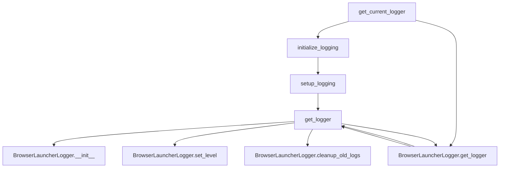

```mermaid
flowchart TD
    get_logger["get_logger"]
    setup_logging["setup_logging"]
    initialize_logging["initialize_logging"]
    get_current_logger["get_current_logger"]
    BrowserLauncherLogger__init__["BrowserLauncherLogger.__init__"]
    set_level["BrowserLauncherLogger.set_level"]
    get_logger_method["BrowserLauncherLogger.get_logger"]
    cleanup_old_logs["BrowserLauncherLogger.cleanup_old_logs"]

    get_current_logger --> initialize_logging
    initialize_logging --> setup_logging
    setup_logging --> get_logger
    get_logger --> BrowserLauncherLogger__init__
    get_current_logger --> get_logger_method
    get_logger_method --> get_logger
    get_logger --> get_logger_method
    get_logger_method --> get_logger
    get_logger --> set_level
    get_logger --> cleanup_old_logs
```